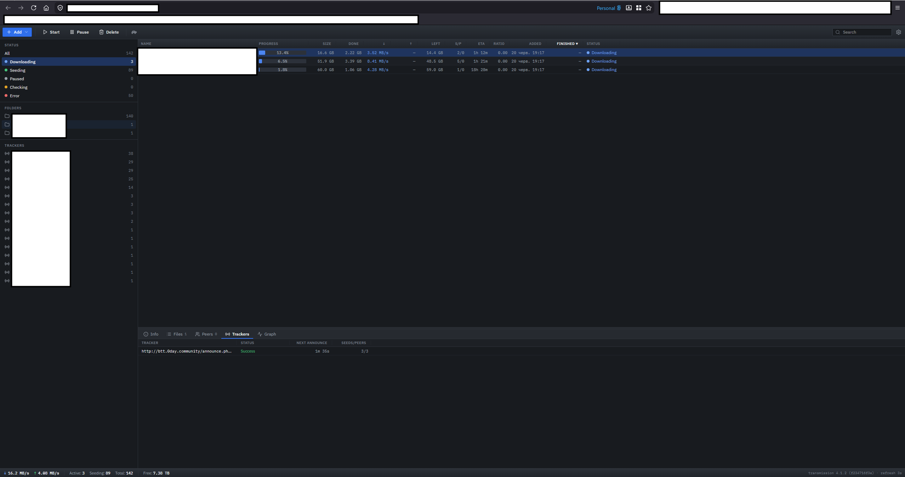
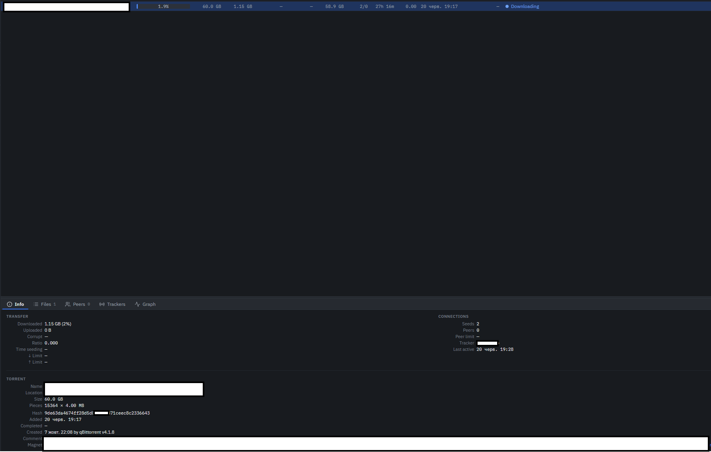
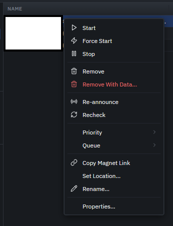

# transmission-web-gui

A dense, information-rich web UI for the [Transmission](https://transmissionbt.com/) BitTorrent daemon, inspired by µTorrent 2.x. Built with React 18 + TypeScript + Vite, deployed via Ansible onto a home server behind nginx.







## Features

- Torrent list with 13 sortable, resizable columns (double-click a column border to auto-fit)
- Sidebar with four collapsible filter sections — Status, Folders, Trackers, Labels; right-click any section item for bulk operations
- **Status filters**: All, Active (downloading or uploading right now), Downloading, Seeding, Paused, Checking, Queued, Error
- Detail panel with Info, Files, Peers, Trackers, and Speed Graph tabs — all with resizable columns
- **Info tab**: transfer stats, connection counts, limits, torrent metadata (hash, pieces, magnet, trackers, comment)
- **Files tab**: per-file progress, multi-select (click / Ctrl+click / Shift+click), right-click menu to set Download/Skip and priority (High / Normal / Low)
- Progress bar with centered percentage label
- Right-click context menu with full torrent actions: Start, Force Start, Stop, Remove, Re-announce, Recheck, Priority submenu, Queue submenu (Top / Up / Down / Bottom), Labels submenu, Copy Magnet Link, Set Location, Rename, Properties
- Right-click any sidebar filter (status, folder, tracker, label) for bulk actions on matching torrents: Start All, Stop All, Re-announce, Recheck, Labels, Remove All
- **Labels**: assign and remove labels per torrent via context menu; filter by label or "No label" in the sidebar; define a preset list of labels in Preferences
- Double-click a torrent row to open its Properties dialog
- **Properties dialog**: per-torrent speed limits, peer limit, seeding ratio and idle limits, editable tracker list
- Keyboard shortcuts: Up/Down navigate selection, `Insert` adds a torrent, `Delete`/`Shift+Delete` remove (with/without data), `F2` renames, `Alt+Enter` opens Properties — shown as hints in the context menu
- Add torrent by URL or magnet file, with a folder field that can be typed freely or picked from known/preset folders via a dropdown
- Real verification progress while checking — both the row progress bar and per-file bars in the Files tab track Transmission's actual recheck progress
- Full Preferences dialog: speeds, port, queues, seeding ratio, label presets, folder presets, date display format; warns before closing with unsaved changes
- Connection settings (RPC URL, username, password) stored server-side in `config.json`
- Auth error banner: when Transmission RPC requires Basic Auth, a banner prompts to open Settings while polling keeps retrying in the background so it reconnects automatically once the RPC endpoint is reachable again
- Dynamic page title showing current download/upload speed when active
- Light / dark theme via `prefers-color-scheme`
- IBM Plex Sans UI + IBM Plex Mono for all numeric values
- Polling every 3 s; pauses when the browser tab is hidden (Page Visibility API)
- Favicons at 16×16, 32×32, 64×64, and 128×128

## Tech stack

| Layer | Technology |
|---|---|
| Frontend | React 18, TypeScript, Vite 6 |
| Styling | Inline styles + CSS custom properties (no UI library) |
| Icons | Lucide SVG paths, embedded inline (no CDN) |
| Backend | FastAPI + uvicorn (Python 3.12) |
| Deploy | Ansible, Docker, nginx |
| Secrets | Infisical |

## Prerequisites

- Node.js ≥ 20
- Python ≥ 3.12
- Docker
- Ansible ≥ 2.17
- Infisical CLI (installed by `install_dependencies.sh`)

## Development setup

```bash
# Install all dependencies (Node, Python, Ansible collections, Infisical CLI)
./install_dependencies.sh

# Start the Vite dev server
# Proxies /transmission/rpc → http://localhost:9091
npm run dev --prefix frontend
```

The dev server is available at `http://localhost:5173/transmission-ui/`.

Transmission must be running locally on port 9091, or you can change the RPC URL via **Preferences → Connection** in the UI after startup.

### Linting

The backend is linted with [ruff](https://github.com/astral-sh/ruff) via a pre-commit hook.

```bash
pre-commit install        # one-time, wires the git hook
pre-commit run --all-files
```

### Running the config-api backend locally

The backend serves and persists the connection config (`config.json`).

```bash
CONFIG_PATH=./frontend/public/config.json uvicorn backend.main:app --reload --port 8095
```

The frontend dev server does **not** proxy `/transmission-ui/api/`, so point the Vite proxy at the local backend by adding to `frontend/vite.config.ts` temporarily:

```ts
'/transmission-ui/api': {
  target: 'http://localhost:8095',
  rewrite: path => path.replace('/transmission-ui/api', ''),
},
```

## Building

```bash
npm run build --prefix frontend   # tsc + vite build → frontend/dist/
```

Output goes to `frontend/dist/`. The base path is `/transmission-ui/`.

## Deployment

Secrets (`transmission-rpc-username`, `transmission-rpc-password`) are read from Infisical project `286db07f-4dba-4ca9-a515-f017d77b8bf1`, path `/hosts/home-server`.

```bash
export INFISICAL_API_URL=...
export INFISICAL_CLIENT_ID=...
export INFISICAL_CLIENT_SECRET=...

cd ansible
ansible-playbook -i inventories/home-server playbooks/deploy.yml
```

The playbook:
1. Builds the Vite frontend locally (`npm run build`)
2. Rsyncs `dist/` → `/opt/docker/nginx/html/transmission-ui/` on the target host
3. Rsyncs `backend/` → `/opt/docker/transmission-ui/backend/`
4. Templates `config.json` with RPC credentials (only on first deploy — not overwritten afterwards)
5. Builds and deploys the `transmission-ui-config-api` Docker container
6. Drops nginx upstream and location configs, reloads nginx

### Resulting nginx routes

| Path | Served by |
|---|---|
| `/transmission-ui/` | Static files from `dist/` |
| `/transmission-ui/api/` | `transmission-ui-config-api` container (FastAPI) |
| `/transmission/rpc` | Transmission daemon (managed by the `infra` repo) |

Auth is handled by the existing `homeserver-access.htpasswd` managed in the `infra` repo.

## Project structure

```
├── frontend/                  # Vite + React application
│   ├── src/
│   │   ├── api/
│   │   │   ├── config.ts          # Connection config: server fetch + localStorage merge
│   │   │   ├── rpc.ts             # Transmission JSON-RPC client (session-id, 409 retry, Basic Auth)
│   │   │   └── types.ts           # Torrent, SessionInfo, TorrentDetails interfaces + field lists
│   │   ├── components/
│   │   │   ├── controls/          # Button, Input, Select, Checkbox, Icon, IconButton
│   │   │   ├── data/              # ProgressBar, StatusBadge
│   │   │   ├── feedback/          # Dialog, ContextMenu
│   │   │   └── navigation/        # Tabs, SidebarItem
│   │   ├── ui/
│   │   │   ├── MainWindow.tsx            # Root: polling, state, dialogs, layout
│   │   │   ├── TorrentTable.tsx          # 13-column grid with resizable/sortable columns
│   │   │   ├── Sidebar.tsx               # Resizable sidebar: Status / Folders / Trackers sections
│   │   │   ├── DetailsPanel.tsx          # Resizable bottom panel: Info/Files/Peers/Trackers/Graph
│   │   │   ├── TorrentPropertiesDialog.tsx # Per-torrent speed/peer/seeding limits + trackers
│   │   │   ├── Toolbar.tsx               # Action buttons + search
│   │   │   ├── StatusBar.tsx             # Session-level stats + free disk space
│   │   │   ├── AddDialog.tsx             # Add torrent by URL/magnet
│   │   │   ├── SettingsDialog.tsx        # Preferences + connection settings
│   │   │   └── GraphTab.tsx              # Speed graph (canvas)
│   │   ├── utils/
│   │   │   ├── format.ts          # size(), rate(), eta(), date(), duration() formatters
│   │   │   └── useResizableCols.ts # Drag-to-resize + double-click auto-fit hook
│   │   └── styles/
│   │       ├── global.css         # Imports + resets
│   │       ├── colors.css         # --text-*, --surface-*, --status-*, --accent-*
│   │       ├── typography.css     # --font-*, --fs-*
│   │       ├── spacing.css        # --row-h, --header-h, --sidebar-w
│   │       └── elevation.css      # --shadow-*
│   ├── public/
│   │   └── config.json            # Local dev only — gitignored
│   ├── index.html
│   ├── vite.config.ts
│   ├── tsconfig.json
│   └── package.json
├── backend/
│   ├── main.py                # FastAPI: GET /config, POST /config
│   ├── requirements.txt
│   └── Dockerfile
├── ansible/
│   ├── ansible.cfg
│   ├── requirements.yml
│   ├── inventories/home-server/
│   └── roles/transmission-ui/
├── docker/
│   └── nginx.conf             # Local dev only (used by docker-compose.yml)
├── .github/
│   ├── workflows/lint.yml     # ruff check + format check on backend/
│   └── dependabot.yml         # pip, npm (frontend/), github-actions
├── .pre-commit-config.yaml    # ruff + ruff-format hooks, scoped to backend/
├── pyproject.toml             # ruff config (quote-style = single)
├── install_dependencies.sh
└── docker-compose.yml         # For local standalone testing
```

## Configuration

### Connection config priority (highest → lowest)

1. **localStorage** — edits saved from the Preferences dialog in this browser
2. **`/transmission-ui/api/config`** — served by the config-api backend, shared across all browsers
3. **Defaults** — `{ url: '/transmission/rpc', username: '', password: '' }`

Clicking **Save** in Preferences writes to both localStorage and the backend. Use **Reset to server defaults** to discard local overrides.

### Column widths and sidebar width

Persisted in `localStorage` per browser. Keys:
- `transmission-col-widths` — main torrent table
- `transmission-sidebar-w` — sidebar width
- `transmission-sidebar-sections` — collapsed/expanded state of sidebar sections
- `transmission-details-h` — detail panel height
- `transmission-details-tab` — last active detail tab
- `transmission-label-presets` — user-defined label preset list (set in Preferences)
- `transmission-dir-presets` — user-defined download folder preset list (set in Preferences)
- `transmission-date-format` — date display format: `locale` (default), `iso`, `eu`, or `us` (set in Preferences)
- `transmission-files-cols`, `transmission-peers-cols`, `transmission-trackers-cols` — detail panel sub-tables

## License

[MIT](https://opensource.org/licenses/MIT)
